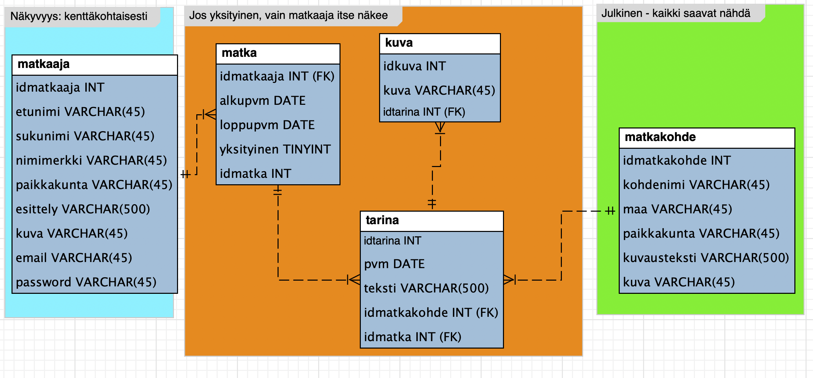

# Ohjelmistotuotanto2

Ryhmätyö: web -pohjainen sovellus
TLDR;
Tehtävänä luoda Kuopion Kulkijat -harrasteryhmälle sosiaalinen alusta, jossa voi jakaa kuvia ja tarinoita toteutuneista matkoista, sekä tallentaa ja muokata matkakohteita.
Kirjautunut käyttäjä pääsee käsiksi ryhmän sisäisiin tietoihin, ja kirjautumattomalle käyttäjälle on rajattu pääsy: esim. tarinoita ei voi nähdä, ellei ole kirjautunut.
Käyttäjä voi muokata vain omia tietojaan, tarinoitaan ja matkojaan. Mikäli matkalla on tarina, sitä ei voi muokata. Mikäli matkakohteeseen on tehty matkoja, sitäkään ei voi muokata.

Oma osuuteni sisälsi matkakohteet -osion, matkojen ja tarinoiden toiminnallisuuden (controllerit ja CRUD-sivut) sekä matkakohteisiin liittyvät testit. Matkakohteiden ulkoasua ja dokumentteja (mm. vaatimus- ja tekninen määrittely) katsottiin yhdessä tiimiläisten kanssa. Matkakohteiden, matkojen ja tarinoiden CRUD-sivut löytyvät kansioista "Pages" kansion alta, matkakohteiden razor -sivut "Pages" kansiosta, controllerit omasta kansiostaan ja AddLocationTest & TripLocationTest ProjectTest:n alta.

Teknologiat: SqLite, ASP.NET / C#, HTML/CSS, REST API, Bunit

-------------------------------------------------------------------------------------------------------------------------------------------------------------------------------------------------------------------------


# Matkakertomus - websovellus

Harrasteporukkamme Kuopion Kulkijat haluaa tilata teiltä web-sovelluksen, johon voimme tallettaa matkakertomuksiamme, esitellä uusia matkakohteita ja tutustua toistemme matkoihin. Sovellus tulee sekä meidän porukkamme omaan käyttöön että julkiseen käyttöön. Jotkut reissut ovat niin henkilökohtaisia, että vain tekijä itse saa niitä katsella.

Tekniset vaatimukset: web-sovellus, jossa on erillinen selainkäyttöliittymä ja erillinen backend-koodi, jotka keskustelevat keskenään REST-rajapinnan kautta. Tiedot pitää tallettaa tietokantaan, kannaksi käy joku SQL-kanta tai vaikka MongoDB-kanta. Meillä ei ole vielä palvelinympäristöä tarjota, joten sovelluksen täytyy pyöriä kehityksen aikana kokonaan toimittajan ympäristössä.

Oheisessa kuvassa olemme hahmotelleet mitä tietoja haluaisimme pystyä tallettamaan. Yksityiskohtia saa muuttaa, esimerkiksi pääavainten tai kuvien toteutus eri tavoin. Jos kantana on MongoDB, sen dokumenttirakenteen saa muodostaa parhaaksi katsomallaan tavalla.
Sivuston ulkoasun täytyy olla siisti ja toteutettu CSS:ää tai CSS-kirjastoja käyttäen.




## Kuvaus käytöstä

Sovelluksessa pitää pystyä rekisteröitymään (sign up). Rekisteröitymisessä annetaan vähintään nimitiedot, nimimerkki, sähköpostiosoite ja salasana. Muut tiedot voi antaa omissa tiedoissa.
Kirjautuminen tapahtuu sähköpostiosoitteen ja salasanan avulla.

## Kirjautumaton käyttäjä:

```
•	saa selata matkakohteita
•	näkee rekisteröitymis- ja kirjautumislinkit
•	näkee muuten valikoissa vain Koti- ja Matkakohde-sivun
•	Koti-sivulla on sopiva kuva ja tervehdysteksti

```
## Kirjautunut käyttäjä:
```
•	näkee valikossa oman nimmarinsa
•	näkee Koti-, Matkakohde-, Porukan matkat-, Omat matkat-, Omat tiedot-, Jäsenet-sivut
•	Matkakohde-sivulla
o	voi lisätä, poistaa, päivittää ja selata matkakohteita. Sellaista matkakohdetta, johon liittyy joku matkakertomus, ei saa poistaa tai päivittää
•	Porukan matkat-sivulla
o	voi selata (ei-yksityisiä) porukan matkoja ja niihin liitettyjä tarinoita ja kuvia
•	Omat matkat-sivulla
o	voi lisätä, selata, päivittää ja poistaa omia matkoja ja niihin liitettyjä tarinoita ja kuvia
o	voi merkitä matkan yksityiseksi, jolloin kukaan muu ei saa nähdä kyseistä matkaa, eikä siihen kuuluvia tarinoita tai kuvia
o	navigointi tarinat- ja kuvat-sivuille voi tapahtuma päävalikon tai sivukohtaisen valikon kautta oman harkinnan mukaan
o	HUOM! Porukan matkat- ja Omat matkat-sivut saisivat olla mahdollisimman yhdenmukaisia
•	Omat tiedot-sivulla
o	voi päivittää omia tietojaan (matkaaja-taulu). Sähköpostin ja salasanan muuttamista ei tarvitse sallia, mutta jos sen sallii, niin se pitää huomioida kirjautumisessa.
•	Jäsenet-sivulla näkee kaikkien jäsenten muut tiedot paitsi salasanan ja sähköpostiosoitteem


```

